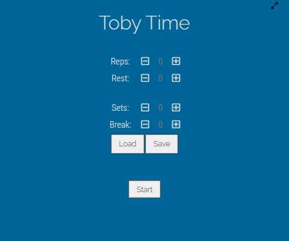
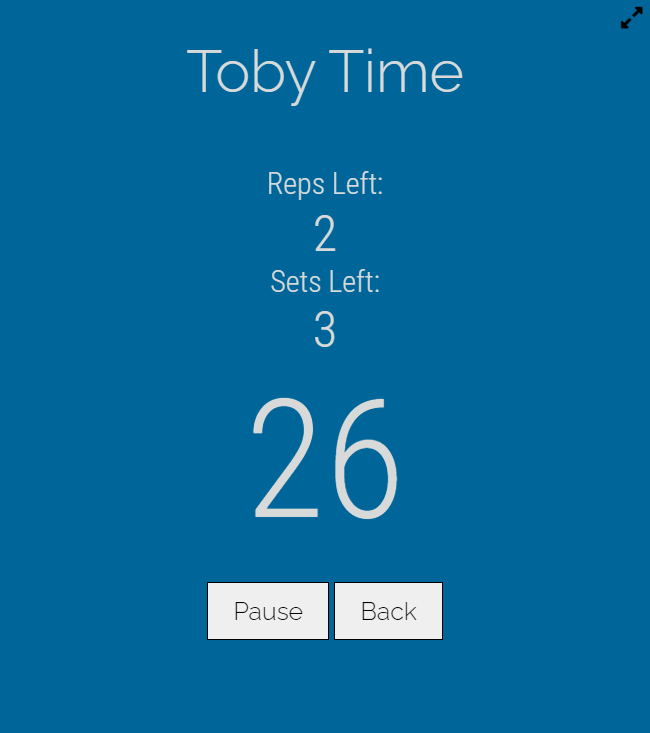
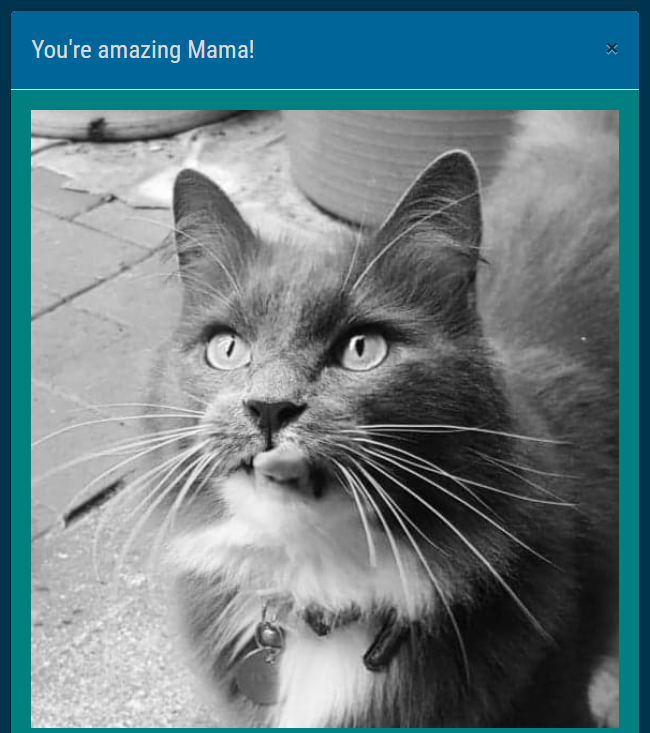

# Toby Time

A workout countdown timer web app that keeps track of your reps and sets then after completion of your workout you are presented with a picture of my cat Toby.

## Description

Upon loading of Toby Timer you are requested to enter the number of reps, sets, rest time between each rep and the break time between each set. Toby Timer gives you the option to save the inputs and give them a name to be loaded for future reference. If there are no saved presets then the app will load the last used inputs.

After you complete your reps eg. 8 pushups, then you press "Start" to begin the rest countdown and to update the number of reps or sets you have to complete for the workout. When there are 3 seconds left of your break or rest then the app will play countdown tones to indicate when the rest or break will be ending.

You can pause the rest timer or go back to the home screen if you wish.

Upon completion of your workout a picture of my cat Toby will pop up with a congratulations message.

Toby Timer is fully responsive thans to Bootstrap.

## Deployed Link

https://conanas.github.io/toby-time/

## Screenshots

###### Welcome Screen

###### Countdown Screen

###### Toby Screen

